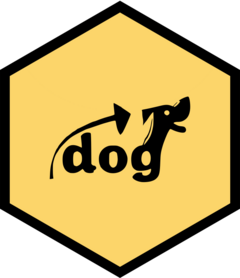

<!-- README.md is generated from README.Rmd. Please edit that file -->

```{r, echo = FALSE}
knitr::opts_chunk$set(
  collapse = TRUE,
  comment = "#>",
  fig.path = "README-"
)
```

# updog 

<!-- badges: start -->
[](https://github.com/dcgerard/updog/actions/workflows/R-CMD-check.yaml)
[](https://app.codecov.io/gh/dcgerard/updog)
[](https://cran.r-project.org/package=updog)
[](https://cran.r-project.org/package=updog)
<!-- badges: end -->

Updog provides a suite of methods for genotyping polyploids from
next-generation sequencing (NGS) data. It does this while accounting
for many common features of NGS data: allele bias, overdispersion,
and sequencing error. It is named
updog for "Using Parental Data for Offspring Genotyping" because we
originally developed the method for full-sib populations, but it works
now for more general populations. The method is described in detail
Gerard et. al. (2018) <[doi:10.1534/genetics.118.301468](https://doi.org/10.1534/genetics.118.301468)>. Additional details concerning 
prior specification are described in Gerard and Ferr&atilde;o (2020) <[doi:10.1093/bioinformatics/btz852](https://doi.org/10.1093/bioinformatics/btz852)>.

The main functions are `flexdog()` and `multidog()`, which provide many options for the
distribution of the genotypes in your sample. A novel genotype distribution
is included in the class of proportional normal distributions (`model = "norm"`). This is the default prior distribution because it is the most robust to varying 
genotype distributions, but feel free to use more specialized priors if
you have more information on the data.

Also provided are:

- `filter_snp()`: filter out SNPs based on the output of `multidog()`.
- `format_multidog()`: format the output of `multidog()` in terms of a multidimensional array.
- Plot methods. Both `flexdog()` and `multidog()` have plot methods. See the help files of `plot.flexdog()` and `plot.multidog()` for details.
- Functions to simulate genotypes (`rgeno()`) and read-counts (`rflexdog()`). These support all of the models available in `flexdog()`.
- Functions to evaluate oracle genotyping performance: `oracle_joint()`, `oracle_mis()`, `oracle_mis_vec()`, and `oracle_cor()`. We mean "oracle" in the sense that we assume that the entire data generation process is known (i.e. the genotype distribution, sequencing error rate, allele bias, and overdispersion are all known). These are good approximations when there are a lot of individuals (but not necessarily large read-depth).


The original `updog` package is now named `updogAlpha` and may be
found [here](https://github.com/dcgerard/updogAlpha).

See also [ebg](https://github.com/pblischak/polyploid-genotyping),
[fitPoly](https://cran.r-project.org/package=fitPoly),
and [polyRAD](https://cran.r-project.org/package=polyRAD). Our best
"competitor" is probably
[fitPoly](https://cran.r-project.org/package=fitPoly), though 
[polyRAD](https://cran.r-project.org/package=polyRAD) has some nice ideas
for utilizing population structure and linkage disequilibrium.

See [NEWS](https://github.com/dcgerard/updog/blob/master/NEWS.md) for the latest updates on the package.

## Vignettes

I've included many vignettes in `updog`, which you can access online
[here](https://dcgerard.github.io/updog/).

## Bug Reports

If you find a bug or want an enhancement, please submit an issue
[here](https://github.com/dcgerard/updog/issues).

## Installation

You can install updog from
[CRAN](https://cran.r-project.org/package=updog) in the usual way:

```{r cran-installation, eval = FALSE}
install.packages("updog")
```

You can install the current (unstable) version of updog from GitHub
with:

``` r
# install.packages("pak")
pak::pak("github::dcgerard/updog")
```

## How to Cite

Please cite

> Gerard, D., Ferr&atilde;o, L. F. V., Garcia, A. A. F., & Stephens, M. (2018). Genotyping Polyploids from Messy Sequencing Data. *Genetics*, 210(3), 789-807. doi: [10.1534/genetics.118.301468](https://doi.org/10.1534/genetics.118.301468).

Or, using BibTex:
``` tex
@article {gerard2018genotyping,
	author = {Gerard, David and Ferr{\~a}o, Lu{\'i}s Felipe Ventorim and Garcia, Antonio Augusto Franco and Stephens, Matthew},
	title = {Genotyping Polyploids from Messy Sequencing Data},
	volume = {210},
	number = {3},
	pages = {789--807},
	year = {2018},
	doi = {10.1534/genetics.118.301468},
	publisher = {Genetics},
	issn = {0016-6731},
	URL = {https://doi.org/10.1534/genetics.118.301468},
	journal = {Genetics}
}
```

If you are using the proportional normal prior class (`model = "norm"`),
which is also the default prior, then please also cite:

> Gerard D, Ferr&atilde;o L (2020). "Priors for Genotyping Polyploids."
_Bioinformatics_, 36(6), 1795-1800. ISSN 1367-4803, doi:
[10.1093/bioinformatics/btz852](https://doi.org/10.1093/bioinformatics/btz852).

Or, using BibTex:
``` tex
@article{gerard2020priors,
    title = {Priors for Genotyping Polyploids},
    year = {2020},
    journal = {Bioinformatics},
    publisher = {Oxford University Press},
    volume = {36},
    number = {6},
    pages = {1795--1800},
    issn = {1367-4803},
    doi = {10.1093/bioinformatics/btz852},
    author = {David Gerard and Lu{\'i}s Felipe Ventorim Ferr{\~a}o},
  }
```

## Code of Conduct

Please note that this project is released with a [Contributor Code of
Conduct](https://github.com/dcgerard/updog/blob/master/CONDUCT.md). 
By participating in this project you agree to abide by its terms.
