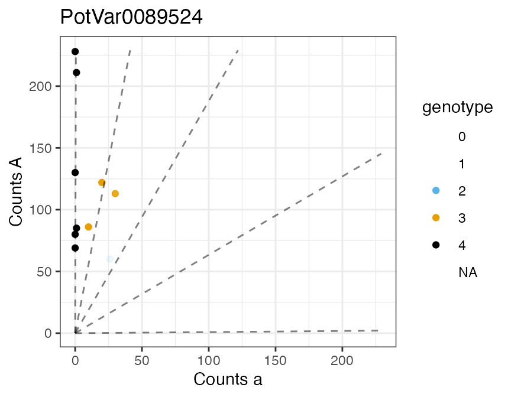

# Genotyping Many SNPs with multidog()

## Abstract

[`multidog()`](https://dcgerard.github.io/updog/reference/multidog.md)
provides support for genotyping many SNPs by iterating
[`flexdog()`](https://dcgerard.github.io/updog/reference/flexdog.md)
over the SNPs. Support is provided for parallel computing through the
[`future`](https://cran.r-project.org/package=future) package. The
genotyping method is described in Gerard et al. (2018) and Gerard and
Ferrão (2020).

## Fit `multidog()`

Let’s load `updog`, `future`, and the data from Uitdewilligen et
al. (2013).

``` r

library(future)
library(updog)
data("uitdewilligen")
```

`uitdewilligen$refmat` is a matrix of reference counts while
`uitdewilligen$sizemat` is a matrix of total read counts. In these data,
the rows index the individuals and the columns index the loci. But for
insertion into
[`multidog()`](https://dcgerard.github.io/updog/reference/multidog.md)
we need it the other way around (individuals in the columns and loci in
the rows). So we will transpose these matrices.

``` r

refmat  <- t(uitdewilligen$refmat)
sizemat <- t(uitdewilligen$sizemat)
ploidy  <- uitdewilligen$ploidy
```

`sizemat` and `refmat` should have the same row and column names. These
names identify the loci and the individuals.

``` r

setdiff(colnames(sizemat), colnames(refmat))
#> character(0)
setdiff(rownames(sizemat), rownames(refmat))
#> character(0)
```

If we want to do parallel computing, we should check that we have the
proper number of cores:

``` r

parallelly::availableCores()
#> system 
#>     16
```

Now let’s run
[`multidog()`](https://dcgerard.github.io/updog/reference/multidog.md):

``` r

mout <- multidog(refmat = refmat, 
                 sizemat = sizemat, 
                 ploidy = ploidy, 
                 model = "norm",
                 nc = 2)
#>     |                                   *.#,%    
#>    |||                                 *******/  
#>  |||||||    (**..#**.                  */   **/  
#> |||||||||    */****************************/*%   
#>    |||    &****..,*.************************/    
#>    |||     (....,,,*,...****%********/(******    
#>    |||                ,,****%////,,,,./.****/    
#>    |||                  /**//         .*///....  
#>    |||                  .*/*/%#         .,/   ., 
#>    |||               , **/   #%         .*    .. 
#>    |||                               ,,,*        
#> 
#> Working on it...done!
```

By default, parallelization is run using

``` r

future::plan(future::multisession, workers = nc)
```

if `nc` is greater than 1. You can choose your own evaluation strategy
by running
[`future::plan()`](https://future.futureverse.org/reference/plan.html)
prior to running
[`multidog()`](https://dcgerard.github.io/updog/reference/multidog.md),
and then setting `nc = NA`. This should be particularly useful in higher
performance computing environments that use schedulers, where you can
control the evaluation strategy through the
[`future.batchtools`](https://cran.r-project.org/package=future.batchtools)
package. For example, the following will run
[`multidog()`](https://dcgerard.github.io/updog/reference/multidog.md)
using forked R processes:

``` r

future::plan(future::multicore, workers = 2)
mout <- multidog(refmat = refmat, 
                 sizemat = sizemat, 
                 ploidy = ploidy, 
                 model = "norm",
                 nc = NA)

## Shut down parallel workers
future::plan(future::sequential)
```

## `multidog()` Output

There is a plot method for the output of
[`multidog()`](https://dcgerard.github.io/updog/reference/multidog.md).

``` r

plot(mout, indices = c(1, 5, 100))
#> [[1]]
```



    #> 
    #> [[2]]


    #> 
    #> [[3]]


The output of multidog contains two data frame. The first contains
properties of the SNPs, such as estimated allele bias and estimated
sequencing error rate.

``` r

str(mout$snpdf)
#> 'data.frame':    100 obs. of  20 variables:
#>  $ snp     : chr  "PotVar0089524" "PotVar0052647" "PotVar0120897" "PotVar0066020" ...
#>  $ bias    : num  0.532 1.033 0.95 1.234 0.853 ...
#>  $ seq     : num  0.00476 0.00222 0.00203 0.00387 0.00206 ...
#>  $ od      : num  0.00304 0.00295 0.00337 0.00275 0.00334 ...
#>  $ prop_mis: num  0.005811 0.002497 0.000881 0.00296 0.002537 ...
#>  $ num_iter: num  6 4 4 5 7 7 3 15 9 4 ...
#>  $ llike   : num  -15.3 -25.2 -10.5 -22.5 -32.2 ...
#>  $ ploidy  : num  4 4 4 4 4 4 4 4 4 4 ...
#>  $ model   : chr  "norm" "norm" "norm" "norm" ...
#>  $ p1ref   : num  NA NA NA NA NA NA NA NA NA NA ...
#>  $ p1size  : num  NA NA NA NA NA NA NA NA NA NA ...
#>  $ p2ref   : num  NA NA NA NA NA NA NA NA NA NA ...
#>  $ p2size  : num  NA NA NA NA NA NA NA NA NA NA ...
#>  $ Pr_0    : num  0.000256 0.248159 0.663422 0.015734 0.083958 ...
#>  $ Pr_1    : num  0.0068 0.4506 0.269 0.0693 0.2015 ...
#>  $ Pr_2    : num  0.0737 0.2542 0.0598 0.1931 0.2968 ...
#>  $ Pr_3    : num  0.32682 0.04457 0.00728 0.34088 0.26855 ...
#>  $ Pr_4    : num  0.592414 0.002427 0.000485 0.381013 0.149184 ...
#>  $ mu      : num  4.17 1.01 -1 3.74 2.29 ...
#>  $ sigma   : num  1.057 0.925 1.289 1.479 1.432 ...
```

The second data frame contains properties of each individual at each
SNP, such as the estimated genotypes (`geno`) and the posterior
probability of being genotyping correctly (`maxpostprob`).

``` r

str(mout$inddf)
#> 'data.frame':    1000 obs. of  17 variables:
#>  $ snp        : chr  "PotVar0089524" "PotVar0089524" "PotVar0089524" "PotVar0089524" ...
#>  $ ind        : chr  "P5PEM08" "P3PEM05" "P2PEM10" "P7PEM09" ...
#>  $ ref        : num  122 113 86 80 69 85 130 228 60 211 ...
#>  $ size       : num  142 143 96 80 69 86 130 228 86 212 ...
#>  $ geno       : num  3 3 3 4 4 4 4 4 2 4 ...
#>  $ postmean   : num  3 2.99 3 4 4 ...
#>  $ maxpostprob: num  1 0.993 1 1 1 ...
#>  $ Pr_0       : num  2.59e-90 6.07e-79 1.62e-77 7.15e-87 5.52e-79 ...
#>  $ Pr_1       : num  2.66e-23 1.28e-16 1.13e-20 2.62e-30 5.16e-27 ...
#>  $ Pr_2       : num  2.99e-06 7.19e-03 2.24e-06 1.59e-14 6.07e-13 ...
#>  $ Pr_3       : num  1.00 9.93e-01 1.00 5.24e-06 2.21e-05 ...
#>  $ Pr_4       : num  1.54e-10 1.05e-15 3.97e-06 1.00 1.00 ...
#>  $ logL_0     : num  -202 -177 -173 -191 -173 ...
#>  $ logL_1     : num  -50.6 -36.5 -44.9 -63.8 -56.2 ...
#>  $ logL_2     : num  -13.78 -7.28 -14.38 -29.85 -26.19 ...
#>  $ logL_3     : num  -2.57 -3.86 -2.87 -11.74 -10.28 ...
#>  $ logL_4     : num  -25.766 -38.946 -15.91 -0.182 -0.159 ...
```

You can obtain the columns in `inddf` in matrix form with
[`format_multidog()`](https://dcgerard.github.io/updog/reference/format_multidog.md).

``` r

genomat <- format_multidog(mout, varname = "geno")
head(genomat)
#>               P1PEM10 P2PEM05 P2PEM10 P3PEM05 P4PEM01 P4PEM09 P5PEM04 P5PEM08
#> PotVar0089524       4       4       3       3       4       4       4       3
#> PotVar0052647       3       1       0       1       1       2       0       1
#> PotVar0120897       0       0       0       0       0       0       0       1
#> PotVar0066020       3       2       3       4       4       3       1       4
#> PotVar0003381       3       1       2       0       2       3       3       1
#> PotVar0131622       2       4       1       2       2       3       4       3
#>               P6PEM11 P7PEM09
#> PotVar0089524       2       4
#> PotVar0052647       1       1
#> PotVar0120897       2       1
#> PotVar0066020       4       2
#> PotVar0003381       4       3
#> PotVar0131622       3       3
```

To filter SNPs based on quality metrics (bias, sequencing error rate,
overdispersion, etc), you can use
[`filter_snp()`](https://dcgerard.github.io/updog/reference/filter_snp.md),
which uses the same non-standard evaluation you are used to from
[`dplyr::filter()`](https://dplyr.tidyverse.org/reference/filter.html).
That is, you can define predicates in terms of the variable names in the
`snpdf` data frame from the output of `mupdog()`. It then keeps rows in
both `snpdf` and `inddf` where the predicate for a SNP evaluates to
`TRUE`.

``` r

dim(mout$snpdf)
#> [1] 100  20
dim(mout$inddf)
#> [1] 1000   17
mout_cleaned <- filter_snp(mout, prop_mis < 0.05 & bias > exp(-1) & bias < exp(1))
dim(mout_cleaned$snpdf)
#> [1] 98 20
dim(mout_cleaned$inddf)
#> [1] 980  17
```

## References

Gerard, David, and Luís Felipe Ventorim Ferrão. “Priors for genotyping
polyploids.” *Bioinformatics* 36, no. 6 (2020): 1795-1800.
<https://doi.org/10.1093/bioinformatics/btz852>.

Gerard, David, Luís Felipe Ventorim Ferrão, Antonio Augusto Franco
Garcia, and Matthew Stephens. 2018. “Genotyping Polyploids from Messy
Sequencing Data.” *Genetics* 210 (3). Genetics: 789–807.
<https://doi.org/10.1534/genetics.118.301468>.

Uitdewilligen, Anne-Marie A. AND D’hoop, Jan G. A. M. L. AND Wolters.
2013. “A Next-Generation Sequencing Method for Genotyping-by-Sequencing
of Highly Heterozygous Autotetraploid Potato.” *PLOS ONE* 8 (5). Public
Library of Science: 1–14.
<https://doi.org/10.1371/journal.pone.0062355>.
